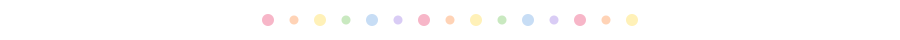
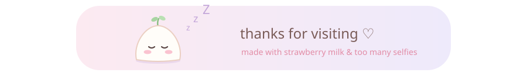

  

  <i>✿ what would this photo look like from where the camera never was? ✿</i>

### 🍡 front view about me

- 🎓 CS @ Pusan National University
- 📷 Curious about turning **one photo into many viewpoints**, while keeping the face the same person
- 🌱 Learning diffusion, NeRF, and 3D Gaussian Splatting, one paper at a time
- 🧪 Learning computer vision with the people at [PNU CV Lab](https://pnucvlab.github.io)

### ☁️ side view what I'm into

  
  
  
  

🌱 **now learning** &nbsp; Diffusion Models, NeRF, 3D Gaussian Splatting

### 🧺 toolkit

  
  
  
  
  
  
  
  
  
  
  
  
  

### 🌙 back view where I came from

  
before vision, I spent my time with LLMs 💬 <i>(click!)</i>

   
  

    
    
    
    
  

### 💌 notes

  
  

 

  

